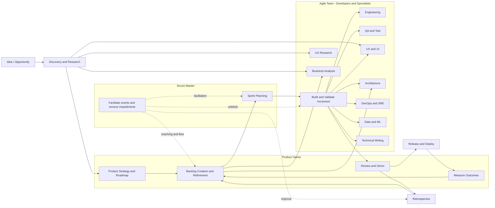

```mermaid
flowchart LR
  A[Idea / Opportunity] --> B[Discovery and Research]
  B --> C[Product Strategy and Roadmap]
  C --> D[Backlog Creation and Refinement]
  D --> E[Sprint Planning]
  E --> F[Build and Validate Increment]
  F --> G[Review and Demo]
  G --> H[Release and Deploy]
  H --> I[Measure Outcomes]
  I --> D

  %% Role groupings
  subgraph PO[Product Owner]
    C
    D
    G
    I
  end

  subgraph SM[Scrum Master]
    E
    J[Facilitate events and remove impediments]
  end

  subgraph TEAM[Agile Team - Developers and Specialists]
    F
    K[Engineering]
    L[QA and Test]
    M[UX and UI]
    N[UX Research]
    O[Business Analysis]
    P[Architecture]
    Q[DevOps and SRE]
    R[Data and ML]
    S[Technical Writing]
  end

  %% Specialist contributions
  B --> N
  B --> M
  B --> O

  D --> O
  D --> P

  F --> K
  F --> L
  F --> M
  F --> P
  F --> Q
  F --> R
  F --> S

  %% Scrum Master improvement loop
  J -. coaching and flow .-> D
  J -. facilitation .-> E
  J -. unblock .-> F
  J -. improve .-> T[Retrospective]
  G --> T
  T --> D

```