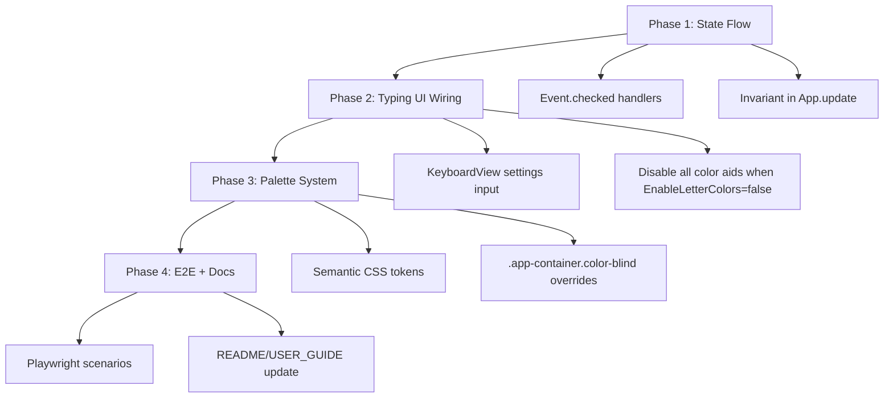

# Settings And Visual Aids Implementation Plan

## Goal
Make all training-aid settings fully effective in the typing experience:
- keyboard visibility
- colored text/keys
- color-blind palette

## Current Gaps
- Settings toggles exist, but handlers flip local state (`not ...`) instead of reading the checkbox value, which is brittle.
- `ColorBlindPalette` is toggled in state, but `.color-blind` styles are not implemented in CSS.
- Keyboard rendering does not have explicit palette/finger-color classes to support normal vs color-blind schemes.
- Behavior is not covered by focused tests.

## Scope
- Client only (`src/Client/*` + Playwright tests).
- No server API changes.

## Detailed Plan

### Phase 1: Stabilize Settings State Flow
Files:
- `src/Client/Pages/StartScreen.fs`
- `src/Client/App.fs`

Tasks:
1. Change all checkbox `OnChange` handlers to read `checked` from the event target instead of toggling with `not`.
2. Keep cross-setting invariants in one place:
- if `ShowKeyboard = false`, force `HighlightNextKey = false`.
3. Enforce invariant in `App.update` at `UpdateSettings` so it remains valid even if future pages update settings.
4. Keep `UserSettings.save` call in `App.update` as single persistence point.

Acceptance criteria:
- Toggling any setting reflects immediately in UI and persists after reload.
- `Highlight next key` cannot remain true while keyboard is hidden.

### Phase 2: Connect Settings To Typing UI Behavior
Files:
- `src/Client/Pages/TypingView.fs`
- `src/Client/Components/KeyboardView.fs`

Tasks:
1. Pass settings context (at minimum `EnableLetterColors`, `ColorBlindPalette`) into keyboard rendering.
2. Define keyboard visual states:
- base key
- next key
- last correct
- last error
- optional per-key color group (for colored keys mode)
3. Ensure `EnableLetterColors = false` disables both text-color and key-color decorations.
4. Ensure `ShowKeyboard = false` removes keyboard section entirely (already mostly done; verify with tests).

Acceptance criteria:
- Keyboard appears/disappears exactly with `ShowKeyboard`.
- Key highlighting and color state follow settings in real time during typing.

### Phase 3: Implement Color-Blind Palette
Files:
- `src/Client/public/style.css`
- `src/Client/App.fs` (already adds `color-blind` class; verify only)

Tasks:
1. Introduce semantic CSS tokens for typing/key states:
- `--state-next`
- `--state-correct`
- `--state-error`
- `--state-current`
- optional `--key-group-*` tokens if using finger groups
2. Define default palette values in `:root`.
3. Add `.app-container.color-blind { ... }` overrides with a tested high-contrast, color-blind-safe set.
4. Ensure all `.char-*` and `.key-*` rules use tokens instead of hard-coded colors.
5. Preserve non-color cues (border, underline, glow) so meaning is not color-only.

Acceptance criteria:
- Toggling color-blind mode changes palette across typing text and keyboard.
- Critical states remain distinguishable without relying on hue alone.

### Phase 4: Regression And UX Hardening
Files:
- `tests/e2e/training-aids.spec.js` (and add a new spec if needed)
- `README.md` / `USER_GUIDE.md`

Tasks:
1. Extend E2E coverage:
- toggle `Show keyboard` off/on and assert keyboard visibility
- toggle `Color letters` and assert class/state changes
- toggle `Color-blind palette` and assert container class and computed style token change
2. Add a persistence check by reloading page and verifying settings restoration.
3. Update docs to describe each setting and expected behavior.

Acceptance criteria:
- Tests fail on regressions in visibility, color toggles, or persistence.
- User docs match implemented behavior.

## Mermaid Workstream

## Execution Order
1. Implement Phase 1 and verify manually.
2. Implement Phase 2 with keyboard-specific classes.
3. Implement Phase 3 tokenized styling.
4. Add/adjust tests and docs in Phase 4.
5. Run E2E tests and ship as one cohesive change set.

## Risks
- Existing CSS may contain hard-coded color values missed during token migration.
- Keyboard key-state classes may conflict when `next` and `last` overlap.
- E2E selectors may be brittle without adding stable `data-testid` attributes.

## Done Definition
- All four settings are visibly effective and persistent.
- Keyboard/text coloring respects both normal and color-blind palettes.
- Playwright coverage protects the behavior.
